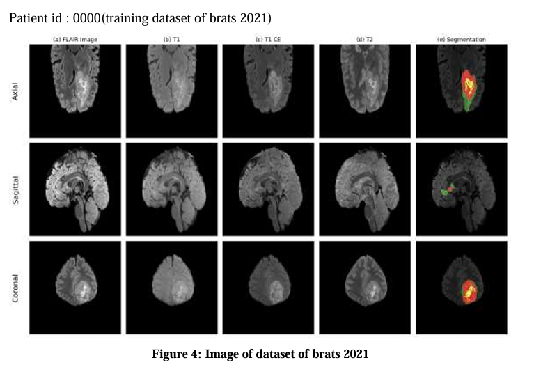
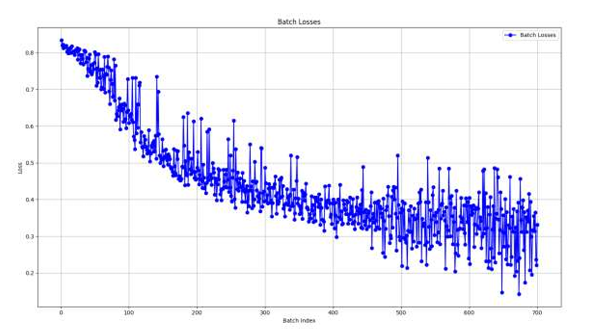
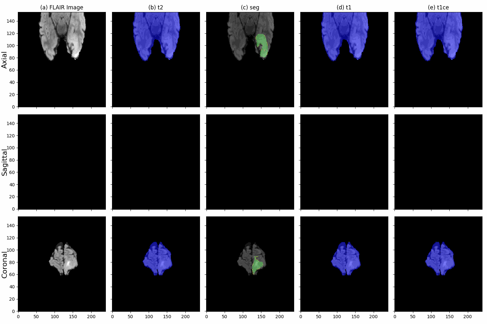

# BraTS -Brain Tumor Segmentation

### Introduction

Gliomas, the most common type of primary brain tumors in adults, pose significant challenges for medical imaging due to their highly heterogeneous nature. They are classified based on their cellular origin and malignancy grade, with timely and accurate segmentation being crucial for effective diagnosis, prognosis, and treatment planning. The Brain Tumor Segmentation (BraTS) challenge, launched in 2012 and updated annually, provides a comprehensive, manually annotated dataset of MRI scans for both low-grade and high-grade gliomas, featuring four modalities (T1, T1C, T2, FLAIR) to capture various tumor characteristics, all formatted in NIFTI for effective evaluation of automated segmentation algorithms.

 

### Dataset

  

Quick preview of training Dataset
    

 

 
  

  Each patient’s dataset includes four distinct MRI modalities: T1-weighted (T1), T1-weighted with contrast enhancement (T1C), T2-weighted (T2), and Fluid-attenuated inversion recovery (FLAIR). These imaging modalities are selected to capture unique sub-regions of the tumor, each offering critical insights into tumor characteristics.
  

  

  The dimensions of each MRI scan are 155×240×240, representing Axial, Coronal, and Sagittal views respectively. This dataset is crucial for evaluating and improving automated brain tumor segmentation algorithms, advancing the capabilities of medical imaging and diagnostics. 
  

  Kaggale Dataset Link : (https://www.kaggle.com/datasets/dschettler8845/brats-2021-task1)

 

### Results and analysis

#### Training Results

  

The training loss initially stood at 0.8337 in the first epoch and consistently decreased over subsequent epochs, indicating a steady generalization pattern as the model learned from the data. By the 100th epoch, the training loss had reached 0.3780, showing significant improvement over the course of training. Similarly, the validation loss exhibited continuous progress, being evaluated every fifth epoch to monitor performance 
on unseen data. At epoch 5, the validation loss was recorded at 0.7858 and showed a steady decline, reaching 0.4320 by the 50th epoch. By epoch 100, the validation loss had further decreased to 0.3780, indicating a strong alignment between training and validation performance and demonstrating the model’s improved generalization capability. 

 

#### Model prediction

   

   
  The model provides infected portion with colored output 

 

### Acknowledment

We extend our deepest gratitude to Dr. Bidur Devkota, our project supervisor and project head, for his unwavering guidance, exceptional leadership, and insightful feedback throughout the development of this project on Brain Tumor Segmentation. His expertise, vision, and timely advice were instrumental in helping us overcome challenges, refine our work, and successfully achieve our objectives. 

